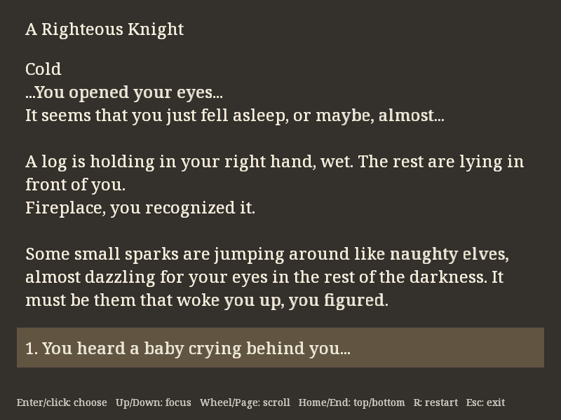
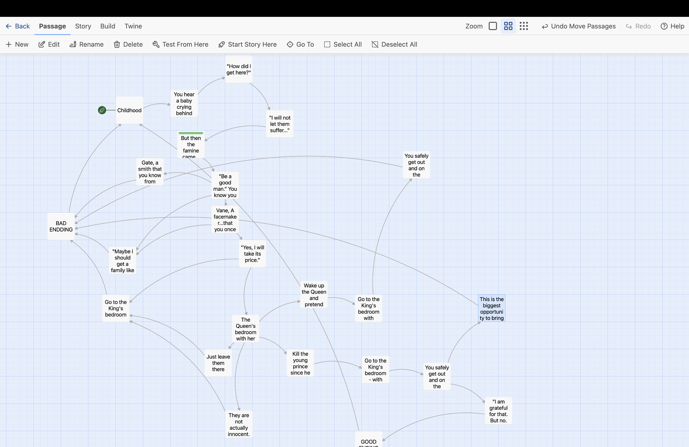

# A Righteous Knight

- **Author**: Yuchen Zhou
- **Description**: Have you ever dreamt of being a knight? A knight that fight for the people. I bet you have. Now it is your chance! People are suffering from Aurthur IV, the notorious, the king. Be careful with what you choose, different paths are lying in front of you. **Draw your sword, knight!**



# Asset Pipeline

## Assets

I wrote the story in Twine and connected the passages with choices. The main assets are the story and the font used to display it:

1. [Story source](assets/story/righteous-knight.twee): the exported Twee file containing the passages, choices, and their connections
2. [Twine HTML export](assets/story/righteous-knight.html): a browser preview of the story, useful for checking the branches while writing
3. [Noto Serif](assets/fonts/NotoSerif.ttf): the font for the story and choices, with its [license](assets/fonts/OFL.txt) and [source information](assets/fonts/README.md)

Here is the story map in Twine. **Spoliers Alert!**



## How it works

I export the story from Twine to [`righteous-knight.twee`](assets/story/righteous-knight.twee). At build time, [`compile_story.py`](tools/compile_story.py) reads the passages, separates the text from the choices, checks that every link has a valid target, and writes the result to `dist/story.bin`. Each passage gets a numeric ID, so the game can follow a choice directly without parsing Twine syntax while playing. The current story has 24 passages and 32 choices. This step is connected to [`Maekfile.js`](Maekfile.js), which also copies the font and its license into `dist/fonts/`. `node Maekfile.js :assets` runs just the asset pipeline.

### Choices

[`Story.cpp`](Story.cpp) loads the compiled story into memory. [`PlayMode.cpp`](PlayMode.cpp) displays the current passage and its choices, then uses `Story::choose()` to find the next passage when the player confirms an option. Entering a new passage resets the scroll position and selected choice. The ending screens link back to the beginning through the same story data, and **R** opens a separate restart confirmation.

### Text Drawing

The text is rendered at runtime. [`TextLayout.cpp`](TextLayout.cpp) uses **HarfBuzz** to turn UTF-8 text into glyph IDs and positions, and wraps it to fit the reading area. [`TextRenderer.cpp`](TextRenderer.cpp) uses **FreeType** to render those glyphs into grayscale bitmaps, stores them in shared texture atlas pages, and draws textured quads with **OpenGL** through [`TextProgram.cpp`](TextProgram.cpp).

The same glyph can be reused across many passages. I do not create a separate texture for every line of text, and scrolling only moves the existing geometry instead of shaping and uploading the text again. The layout adjusts when the window size changes, and the font is rasterized at the display's pixel density to keep it clear on high-DPI screens.

# How To Play:

1. You are the knight. Read each passage and decide what you want to do next. Your choices lead to different routes and endings. **Remember, "Be a good man," like your mom used to say.**
2. Press **Up/Down** to select an option, then **Enter** to confirm. You can also click an option directly.
3. Some passages are long. Use the mouse to scroll. Home/End takes you to the top or bottom, and selecting an option with the keyboard scrolls it into view.
4. Want to try another path? Press **R**, then choose **Restart**. Choose **Keep reading** or press **Escape** to cancel. Both ending screens also have a choice that returns to the beginning.
5. Press **Escape** during normal reading to exit. **PrintScreen** saves `screenshot.png` in the current working directory.

# About the Story

**Spoilers Alert! ⚠️ Read this after playing through the end.**

I have to admit it is not a 2-5 minute story. I spent a whole day writing the plot. It has **five total bad endings and only one good ending.** It requires courage, wisdom, and a bit of luck to complete. Roughly 30-40 minutes to explore all the endings. 

I really like my original idea of this story, that's why I don't want to just do a short version of it. At first, I only thought of the good ending (which I already has this idea when I first watch Game of Thrones, I feel like it is the only way to the Iron Throne, no matter who will sit on it), the corrupted knight bad ending and the evil son bad ending. I especially like the corrupted bad ending, which I feel like it is very sarcastic and realistic.

Let me know what do you think! I will continue working on other endings and branches of the stories later on.

# Build and Run

Follow [NEST.md](NEST.md) to set up the compiler and course libraries. The story compiler also needs Python 3.

```sh
node Maekfile.js
./dist/game
```

On Windows, build from the Visual Studio developer command prompt and run `dist\game.exe`. If Python 3 is installed as `python`, set `PYTHON=python` before building.

To share the game, keep the complete `dist/` folder together, including `story.bin`, `fonts/`, and the library licenses. Twine is only needed to edit the story. More details are in the [asset pipeline notes](docs/asset-pipeline.md) and [validation notes](docs/validation.md).

# Acknowledgements

The story was written and organized in Twine. The game uses Noto Serif from [Google Fonts](https://github.com/google/fonts/tree/main/ofl/notoserif), licensed under the [SIL Open Font License 1.1](assets/fonts/OFL.txt).

Text rendering references include the [HarfBuzz example](https://github.com/harfbuzz/harfbuzz-tutorial/blob/master/hello-harfbuzz-freetype.c) and the [FreeType tutorial](https://freetype.org/freetype2/docs/tutorial/step1.html).

This game was built with [NEST](NEST.md).
